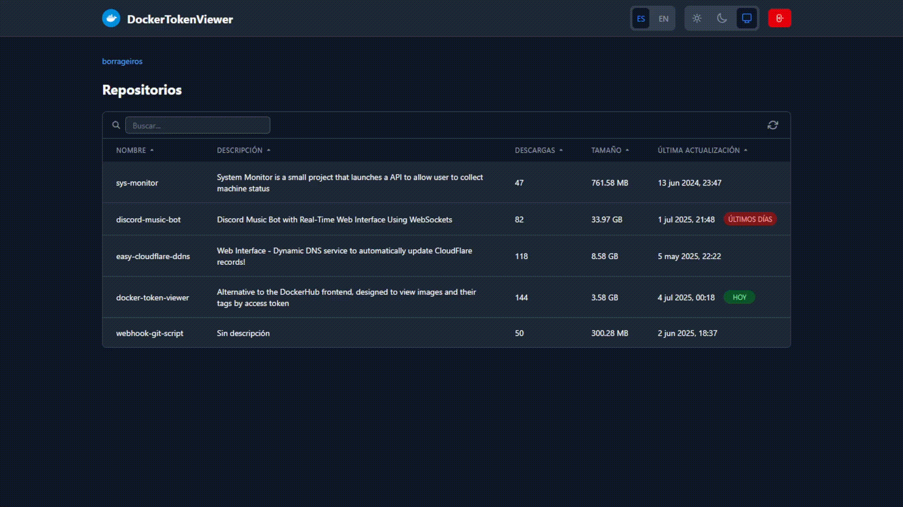

# 🐳 DockerTokenViewer

DockerTokenViewer is an alternative to the DockerHub frontend, designed to allow users to view images and their respective tags associated with a profile or organization using an access token.

## ✨ Key Features

- 🔑 **Access with Docker Tokens**: Use Docker CLI tokens (commonly used for pull and push operations) to query repositories and view image tags.
- 👁️ **Read-Only Interface**: Tokens cannot be used to log into the DockerHub website, but they work seamlessly with this tool to retrieve repository information.
- 🛠️ **Utility**: Ideal for scenarios where you need to inspect tags of a specific repository without full access to DockerHub's GUI.
- 🔒 **Secure Storage**: Account credentials are encrypted before being stored in localStorage.

## 🔧 Technical Details

- 🌐 **Official DockerHub API**: Interacts with the official DockerHub API to fetch and display data.
- 🛠️ **Built With**:
  - **SvelteKit** ⚡: Fullstack framework
  - **TailwindCSS** 🎨: For styling
  - **DockerHub API** 🐋: To fetch repository and tag information

## 📸 Screenshot



## 🔑 Environment Variables

The application requires the following environment variable to be set:

```
PRIVATE_SECRET_KEY=your_secret_key_here
```

This environment variable is used to encrypt account information before storing it in the browser's localStorage, enhancing security by protecting sensitive data like Docker tokens. The encryption is performed server-side, ensuring that the secret key remains private.

## 🐳 Docker

You can find 2 previous builds on Docker Hub:

🔗 **[Link to Docker Hub tags](https://hub.docker.com/repository/docker/borrageiros/docker-token-viewer/tags)**

### 📦 Available Images

- 🖥️ **latest**: for amd64 distributions

  ```bash
  borrageiros/docker-token-viewer:latest
  ```

- 🔧 **arm64**: for arm64 distributions
  ```bash
  borrageiros/docker-token-viewer:arm64
  ```

### 🚀 Example Usage

```bash
docker run -d \
  -p 3000:3000 \
  -e PRIVATE_SECRET_KEY=your_secret_key_here \
  --name dockertokenviewer \
  --restart always \
  borrageiros/docker-token-viewer:latest
```

## 📦 Development or node deployment

### 📦 Development

```bash
# Create a .env file with the required environment variable
echo "PRIVATE_SECRET_KEY=your_development_secret_key" > .env

# Install dependencies and start development server
npm install
npm run dev
```

### 📦 Node deployment

```bash
# Create a .env file with the required environment variable
echo "PRIVATE_SECRET_KEY=your_production_secret_key" > .env

# Install dependencies, build and run the application
npm install
npm run build
node build
```

---

⭐ **Star this repository if you find it useful!**
